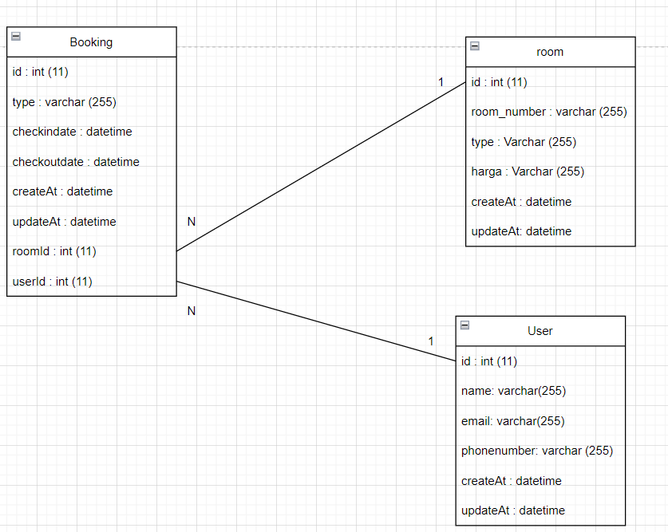
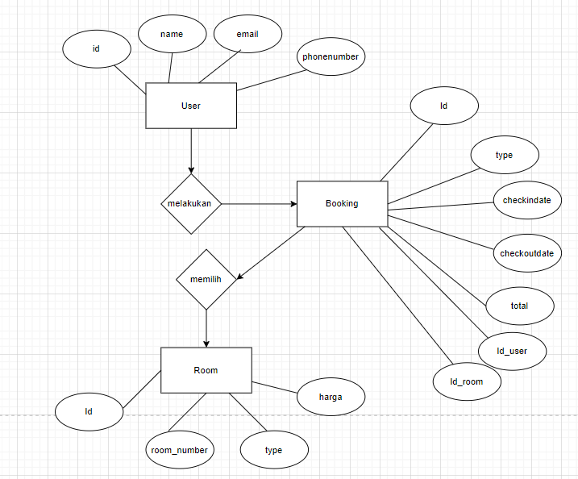
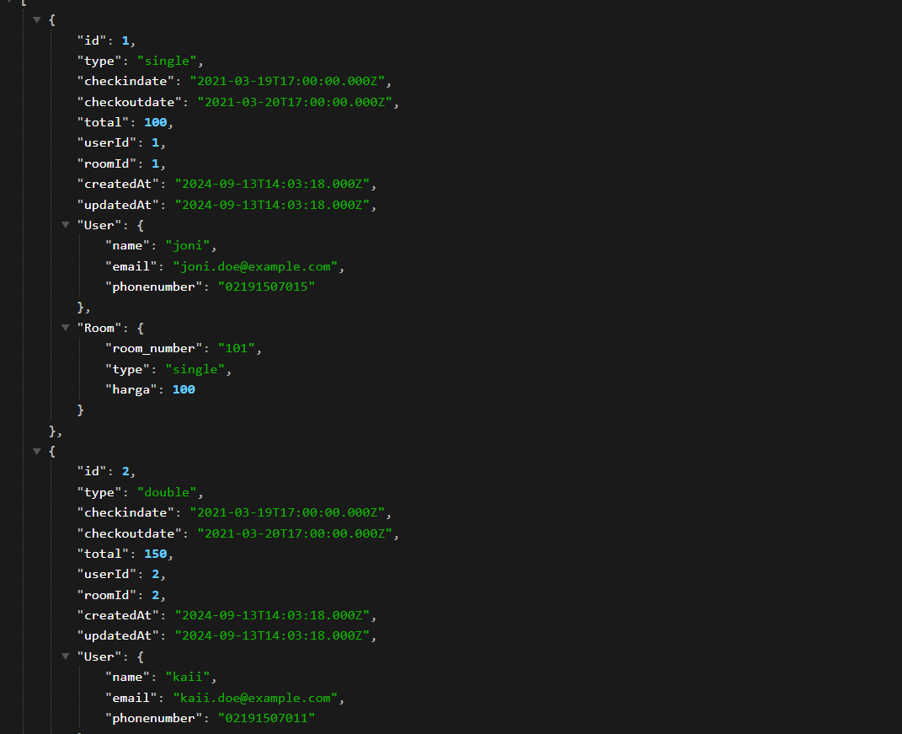

# RESTFULL API MANAJEMEN BOOKING HOTEL SEDERHANA
<br>

## Deskripsi Projek 

**API Kelola Peminjaman Kendaraan** adalah sebuah Rest Full API yang dirancang untuk memudahkan pengelolaan data Hotel menggunakan Express JS sebagai framework dan sequelize dalam pemilihan orm di Node.js. API ini memungkinkan pengguna untuk melakukan operasi CRUD (Create, Read, Update, Delete)


## Fitur

### 1. Tabel `Users`
- **Fungsi**: Menyimpan informasi pengguna sistem.
- **Kolom**:
  - `id`: ID unik pengguna (PK, auto-increment).
  - `name`: Nama lengkap pengguna.
  - `email`: Alamat email pengguna (unik).
  - `password`: Kata sandi pengguna (hash).
  - `createdAt`: Waktu pembuatan data.
  - `updatedAt`: Waktu pembaruan data.

### 2. Tabel `Rooms`
- **Fungsi**: Menyimpan informasi tentang kamar yang tersedia di hotel.
- **Kolom**:
  - `id`: ID unik kamar (PK, auto-increment).
  - `roomNumber`: Nomor kamar.
  - `roomType`: Tipe kamar (misalnya, single, double, suite).
  - `price`: Harga per malam.
  - `status`: Status ketersediaan kamar (misalnya, tersedia, tidak tersedia).
  - `createdAt`: Waktu pembuatan data.
  - `updatedAt`: Waktu pembaruan data.

### 3. Tabel `Bookings`
- **Fungsi**: Menyimpan informasi pemesanan kamar oleh pengguna.
- **Kolom**:
  - `id`: ID unik pemesanan (PK, auto-increment).
  - `userId`: ID pengguna yang membuat pemesanan (FK, mengacu ke `Users`).
  - `roomId`: ID kamar yang dipesan (FK, mengacu ke `Rooms`).
  - `checkInDate`: Tanggal check-in.
  - `checkOutDate`: Tanggal check-out.
  - `createdAt`: Waktu pembuatan data.
  - `updatedAt`: Waktu pembaruan data.

  ### Relasi Antar Tabel
- **User dan Booking**:
  - Relasi **one-to-many**: Satu pengguna (`User`) bisa memiliki banyak pemesanan (`Booking`).
  
- **Room dan Booking**:
  - Relasi **one-to-many**: Satu kamar (`Room`) bisa dipesan dalam banyak pemesanan (`Booking`).


<br>

## Dependecies / Teknologi yang digunakan

1. **express**

    Express JS sebagai framework Node.js untuk mengelola request dan response HTTP

    ```bash
   npm i express
    ```

2. **mysql**

    package untuk melakukan koneksi ke database

    ```bash
    npm i mysql
    ```

3. **dotenv**

    Dotenv untuk mengatur variabel lingkungan
    ```bash
    npm i dotenv
    ```

4. **cors**

    Untuk memberikan akses pada forntEnd

    ```bash
    npm i cors
    ```
5. **sequelize**

    Sebagai Orm yang dipakai

    ```bash
    npm i sequelize
    ```
6. **nodemon**

    jalankan dengan mengetikan perintah (nodemon namaFile)

    ```bash
    npm install nodemon
    ```

    Perintah ini akan menjalankan server secara terus menerus

    Aplikasi akan berjalan pada port yang ditentukan di file `.env` .

    <br>
    

## Cara Penggunaan

1. Pastikan Node.js dan npm telah terinstall di komputer Anda.
2. Clone atau download projek ini ke direktori lokal Anda.
3. Jalankan `npm install` untuk menginstall dependensi yang diperlukan.
4. Buat file `env` dan beri variabel PORT dan DB_NAME (sesuai nama database).
5. Jalankan `node models/index.js` untuk membuat Table.
6. Untuk melakukan testing / mengisi contoh data jalankan `node seeders/seeders.js` (opsional).
6. Jika table database sudah dibuat jalankan aplikasi dengan command `node index.js` / `nodemon index.js`.
7. Aplikasi akan berjalan di `http://localhost:PORT`, dengan PORT adalah nomor port yang ditentukan dalam file `.env`.

<br>


## Hal Yang Berkaitan

Beberapa Contoh Gambar Yang Berkaitan Terkait Projek REST FULL API Perpustakaan

- **Class Diagram**


- **ERD (Entity Relationship Diagram)**



- **Relasi Table**


- **Hasil User**


- **Hasil Room**

<br>

- **Hasil Booking**



## Kontribusi

Jika Anda ingin berkontribusi pada projek ini, silakan lakukan pull request dengan perubahan yang Anda inginkan. Pastikan perubahan Anda sesuai dengan tujuan dan struktur projek ini.

```
    Buat Code Disini
```

<br>

## Kontak

- **Nama:** Mahaga Najwan Kaidan
- **Github:** (https://github.com/MahagaNajwanKaidan)

<br>